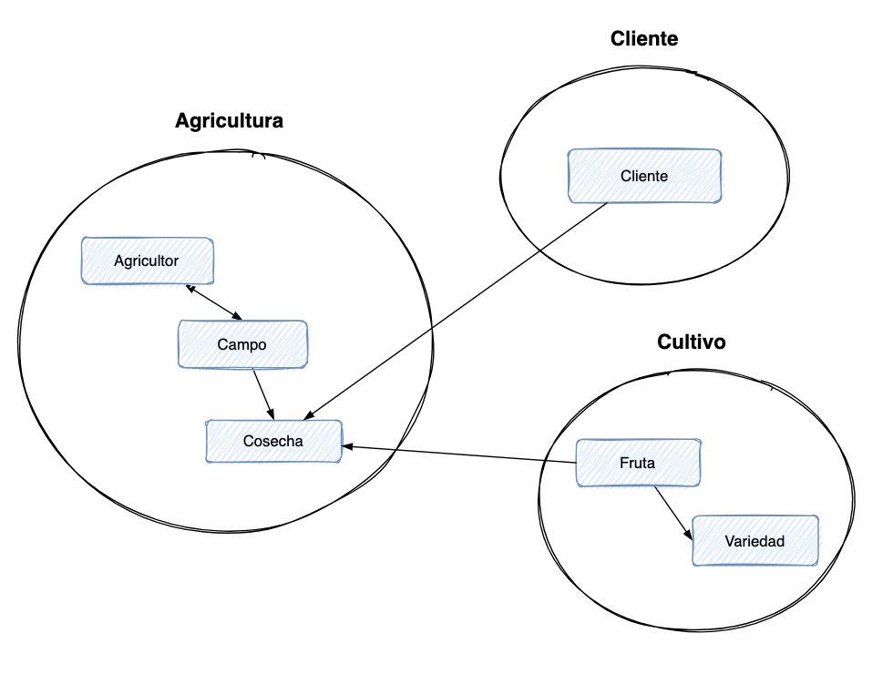
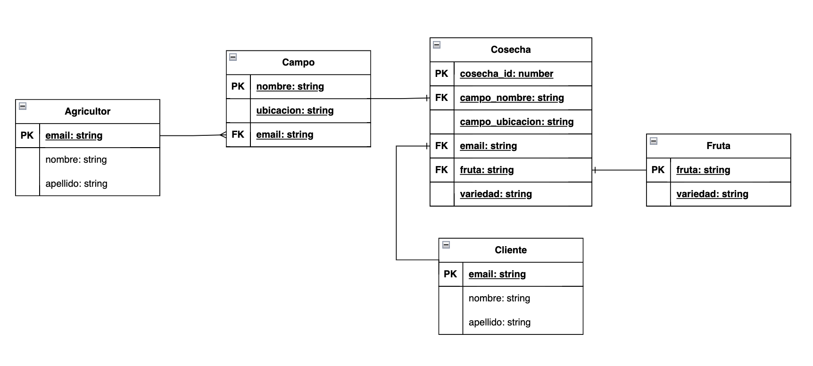
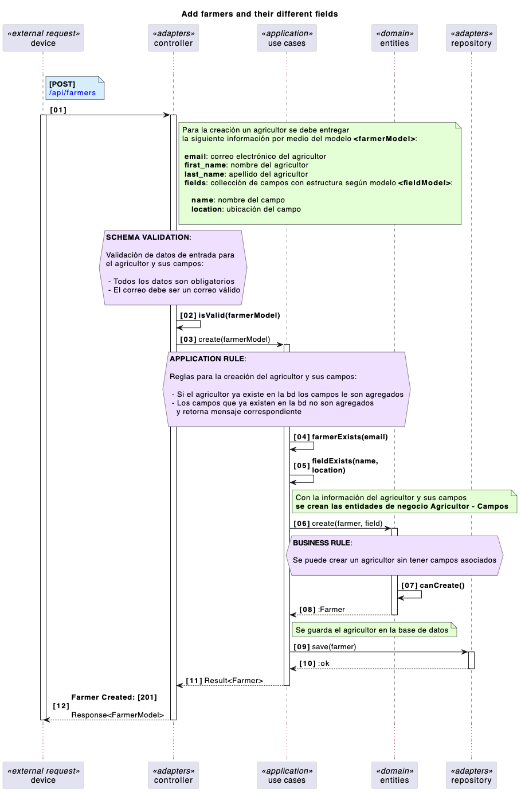
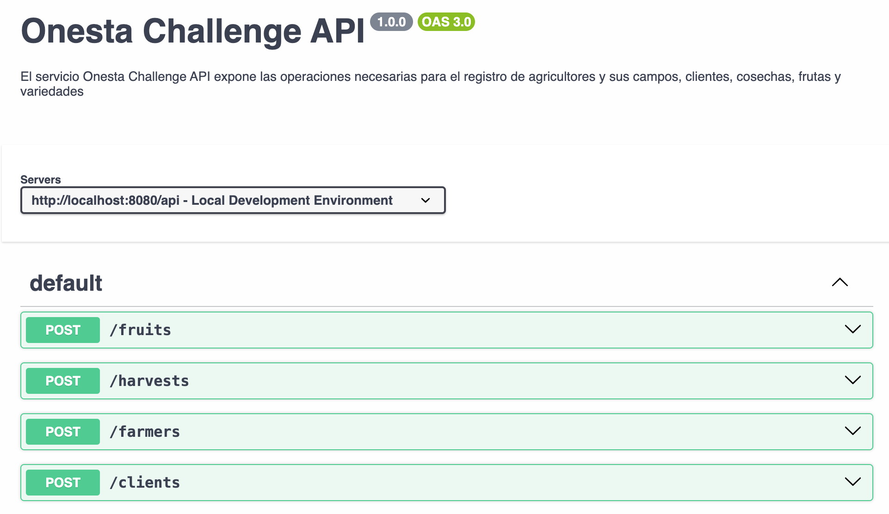

# Desafío Onesta

A continuación se presenta la solución (diseño e implementación) del desafío Onesta correspondiente al desarrollo de una API Rest en NodeJS/Typescript/SQLite. El enunciado del desafío es el siguiente:

```
Construir una pequeña API en TypeScript, usando SQLite que permita agregar:

1.- Frutas y sus distintos tipos de Variedades.
2.- Cosechas.
3.- Agricultores y sus distintos Campos.
4.- Clientes.

También debe incluir una ruta que al enviarle un CSV lo lea y cargue su data dentro de la DDBB.

El mail debe ser único dentro de los agricultores.
El mail debe ser único dentro de los clientes.
La combinación Nombre Ubicación de los campos debe ser única.
El nombre de la fruta debe ser única.
La combinación fruta variedad debe ser única.

Se valorara:

1.- Orden de código.
2.- Orden de commits.
3.- Validaciones de schema.
4.- Separación de concerns.
5.- Manejo de errores.

Nice to Do:
Usar una arquitectura de DDD.
```

# Diseño

Se trata de dar solución al problema con un enfoque de "design-first". El problema comprende la creación de un conjunto de datos por medio de una API Rest (microservicio). Para el diseño de la solución se comienza definiendo las entidades del negocio (dominio), encontrándose: Agricultor, Cliente, Campos, Cosecha, Fruta y Variedades:



En el esquema arriba, se agrupan las entidades de negocio según su funcionalidad. En Agricultura se establece el proceso agricola, desde la siembra hasta la cosecha. En Cliente se referencia a la comercialización de los productos agrícolas y, finalmente, en Cultivo se relaciona específicamente con los productos agrícolas que se involucran en el proceso agrícola. El fin de estas agrupaciones de negocio es comprender de mejor manera los casos de uso que se requieren implementar.

Según el enunciado y el archivo .csv entregado, se pueden establecer algunos atributos iniciales y las relaciones que pueden tener las entidad de negocio. A continuación, se presenta el esquema inicial de entidad-relación, con dichos atributos y que será implementado posteriormente en SQLite:



En el esquema anterior, se simplificará en la implementación la entidad Variedades, dejando fijo los valores: SMALL, MEDIUM, LARGE y EXTRA LARGE dentro de la aplicación para la asignación a la entidad Fruta.

Supuestos:
1 Campo solo puede tener 1 Cosecha

La aplicación se diseñará considerando una arquitectura limpia (hexagonal), aplicando los principios SOLID y, si es necesario, aplicar patrones de diseño.

## Casos de uso

Según el enunciado se tienen 4 casos de uso a implementar más 1 caso de uso "principal" para permitir la carga de datos masivos (archivo .csv) y que utilizará los 4 casos de uso anteriores para su funcionamiento. Si bien, se implementarán todos los casos de uso, solo se diseñará y documentará como ejemplo el caso de uso: *Agricultores y sus distintos Campos*; para la implementación de los otros casos de usos se seguirá el mismo patrón

## Diagrama de secuencia

A continuación, se presenta el diagrama de secuencia del caso de uso *Agricultores y sus distintos Campos*. En el diagrama se puede apreciar (de forma simplificada) las interacciones entre las capas de la arquitectura limpia, así como las reglas de aplicación y negocio:



## OPEN API (Swagger)

Se ha generado un archivo .yml con la documentación inicial de la API considerando el análisis que se ha realizado hasta ahora. El archivo se encuentra [AQUI](docs/swagger/challenge-swagger.yml)



# Implementación

## Estructura de carpetas

Para la estructura de carpeta se utiliza arquitectura hexagonal + vertical slicing, quedando de la siguiente manera (ejemplo):

- src /
    fruits /
      application /
      domain /
      infrastructure/
    farmers /
      application /
      domain /
      infrastruture /
...

## Librerías

Para la creación del proyecto se utilizará principalmente:

express
tsyringe
zod
sqlite3
typeorm
jest

